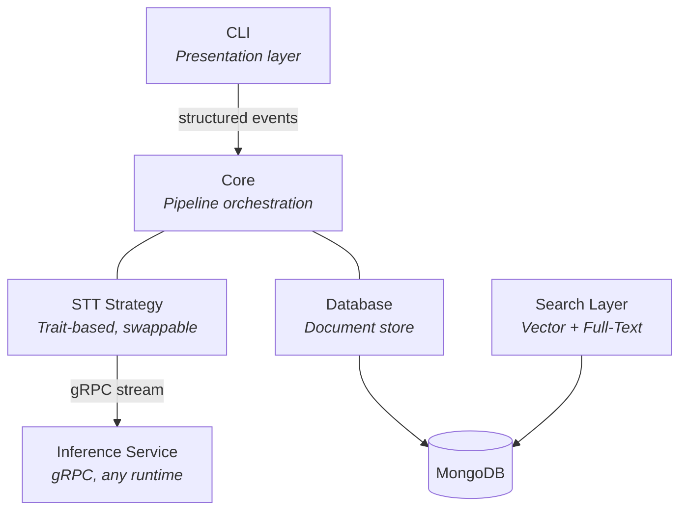

# Architecture

Vetta is designed around two core principles: **decoupled inference** and **strict separation between logic and
presentation**.

The speech-to-text engine is abstracted behind a trait, meaning the orchestration pipeline doesn't know or care which
model, runtime, or language powers transcription. Swapping from a local Whisper instance to a remote API is a
configuration change, not a rewrite.

The core library never produces user-facing output. It emits structured events that consumers — a CLI today, potentially
a GUI or API tomorrow — render however they choose.

## System Overview



## Pipeline

Every earnings call follows the same pipeline:

1. **Validate** — Check file integrity, format, and size before any processing begins.
2. **Transcribe** — Stream audio through the STT strategy and collect segments as they arrive.
3. **Store** — Persist the source transcript to `earnings_calls`.
4. **Chunk** — Split the transcript into dialogue turns and write each as a document in `earnings_chunks`.
5. **Embed** — Generate vector embeddings for each chunk and write them alongside the text.

Each stage emits events. The core decides **what** happened; the consumer decides **how** to show it.

The pipeline status is tracked on the source document:

```
ingested → transcribed → chunked → processed
                                  ↘ failed
```

## Storage Design

The database uses two collections with distinct responsibilities:

- **`earnings_calls`** — One document per call. The immutable source of truth. Contains the full transcript, speaker
  registry, and ingestion metadata. No embeddings.
- **`earnings_chunks`** — One document per dialogue turn. The search-optimized collection. Contains text, embeddings,
  and denormalized metadata for filtering.

This separation allows chunking strategies and embedding models to evolve independently. When you change how chunks are
produced or upgrade the embedding model, `earnings_chunks` is rewritten without touching `earnings_calls`.

See [Data Model](/technical/data-model) for schemas, field references, and indexes.

## Search

The `earnings_chunks` collection supports three retrieval modes:

- **Semantic search** — Atlas Vector Search over the `embedding` field with pre-filtering on metadata.
- **Full-text search** — Atlas Search with `lucene.english` analyzer over the `text` field.
- **Hybrid + reranking** — Candidates from vector and text search are merged, then reranked application-side.

See [Search & Retrieval](/technical/search-retrieval) for index definitions and query patterns.

## Key Decisions

| Decision                 | Rationale                                                                                                                          |
|--------------------------|------------------------------------------------------------------------------------------------------------------------------------|
| Trait-based STT          | The pipeline is independent of any specific model or runtime. Strategies are swappable without touching orchestration.             |
| Streaming transcription  | Segments are yielded as they're recognized, enabling real-time progress feedback and bounded memory usage.                         |
| Event-driven progress    | The core emits structured events instead of printing. Any consumer (CLI, GUI, API) can render them.                                |
| Contextual errors        | Errors carry diagnostic codes and actionable help, so failures are immediately understandable without reading source code.         |
| Two-collection model     | Source transcripts and search-optimized chunks are separated so embedding models and chunking strategies can evolve independently. |
| Denormalized filters     | Metadata is copied onto chunks so vector and text search stages can filter without cross-collection joins.                         |
| Context window on chunks | Each chunk stores its neighboring dialogue turns, giving rerankers and LLMs surrounding context without additional queries.        |