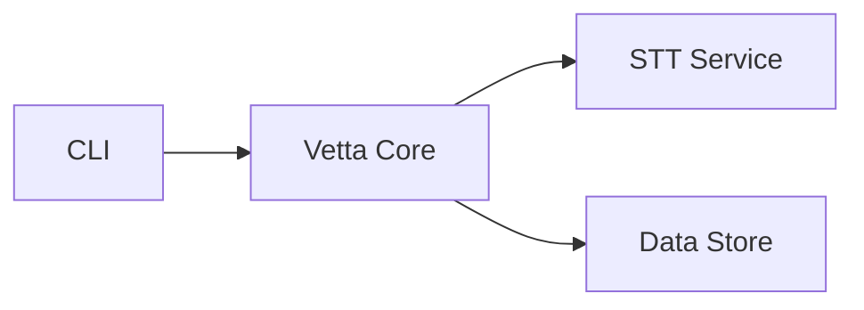

# Architecture

Vetta is designed around two core principles: **decoupled inference** and **strict separation between logic and
presentation**.

The speech-to-text engine is abstracted behind a trait. The orchestration pipeline doesn't know or care which model,
runtime, or language powers transcription. Swapping from a local Whisper instance to a remote API is a configuration
change, not a rewrite.

The core library never produces user-facing output. It emits structured events that consumers render however they
choose.

## System Overview

## Storage

Two collections with distinct responsibilities:

- **`earnings_calls`** — One document per call. Immutable source of truth. Full transcript, speaker registry, ingestion
  metadata. No embeddings.
- **`earnings_chunks`** — One document per dialogue turn. Search-optimized. Text, embeddings, and denormalized metadata
  for filtering.

This separation lets chunking strategies and embedding models evolve independently. Reprocessing chunks never touches
source transcripts. See [Data Model](/technical/data-model) for schemas, field references, and indexes.

## Search

`earnings_chunks` supports three retrieval modes:

- **Semantic** — Atlas Vector Search over embeddings with metadata pre-filtering.
- **Full-text** — Atlas Search with `lucene.english` analyzer.
- **Hybrid** — Candidates from both paths merged and reranked application-side.

## Key Decisions

| Decision                  | Rationale                                                                                                 |
|---------------------------|-----------------------------------------------------------------------------------------------------------|
| Trait-based STT           | Pipeline is independent of any model or runtime. Strategies swap without touching orchestration.          |
| Streaming transcription   | Segments yield as recognized. Real-time progress, bounded memory.                                         |
| Event-driven progress     | Core emits structured events. Any consumer renders them.                                                  |
| Contextual errors         | Errors carry diagnostic codes and actionable help. Failures are understandable without reading source.    |
| Two-collection model      | Source transcripts and search chunks are separated so embedding and chunking can evolve independently.    |
| Denormalized filters      | Metadata lives on chunks so search can filter without cross-collection joins.                             |
| Context windows on chunks | Each chunk stores neighboring turns, giving rerankers and LLMs surrounding context without extra queries. |